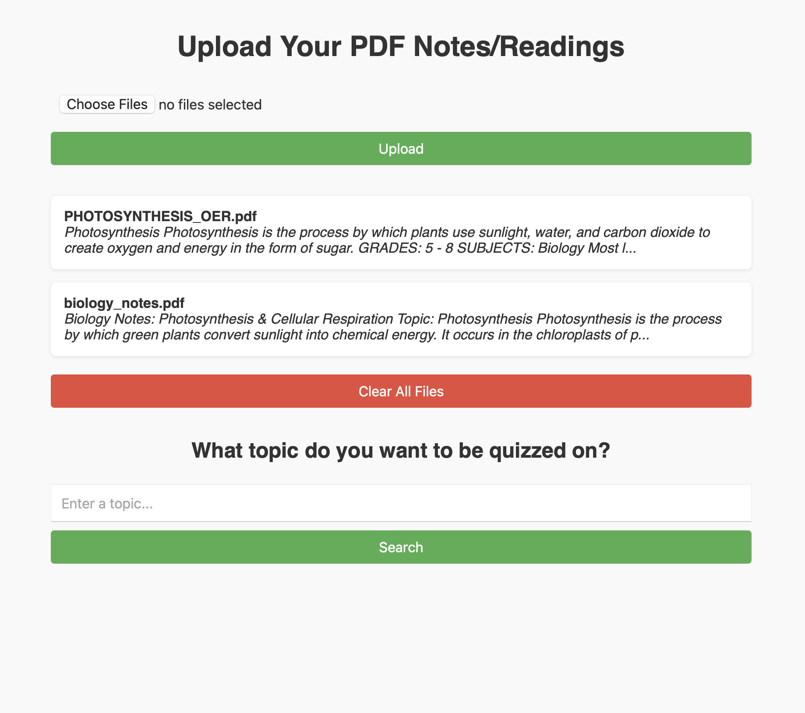
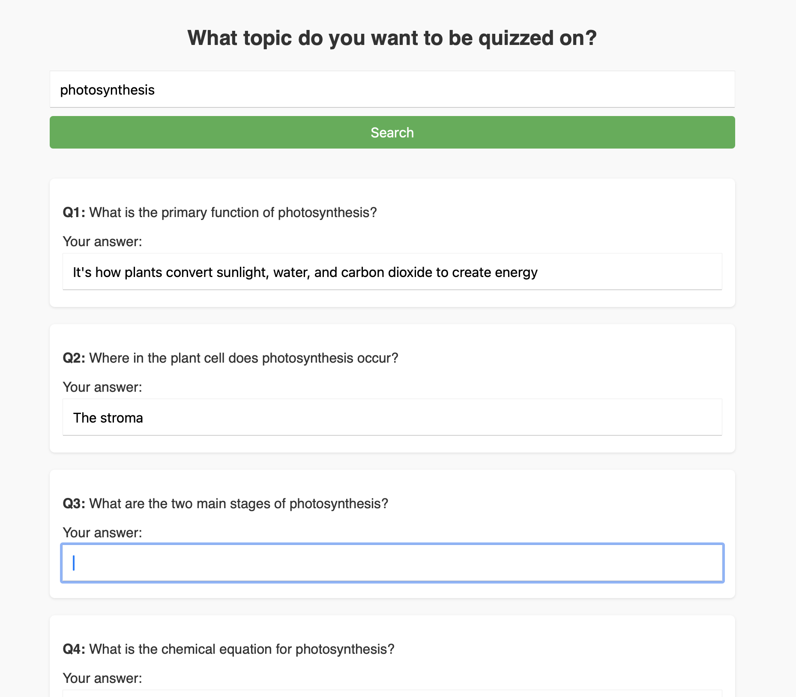
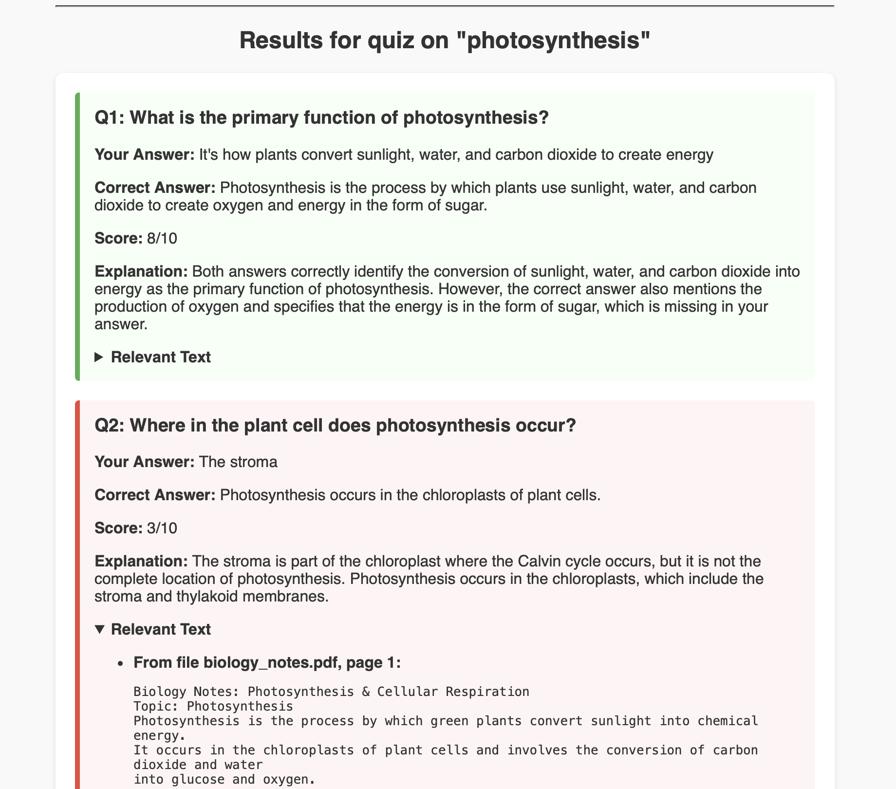

# NoteQuizzer - Quiz yourself with the content from your notes/readings!

NoteQuizzer is a Flask-based web app that lets you upload your PDF class notes or readings, then quiz yourself on a specific topic using AI. It uses semantic search and large language models to generate relevant quiz questions and evaluate your answers — giving you instant feedback and insights based on your own materials.

### 1. Upload your notes

### 2. Set a topic and complete your quiz   

### 3. View your results   

## Features:

- Upload PDF notes/readings 
- Automatically chunks your content for vector-based semantic search
- Generates AI-powered quiz questions based on specific topics
- Scores answers and gives an explanation using natural language comparison
- Shows the relevant text (with file name and page number) for each question 

## Tech Stack:

- Flask – web framework
- SQLAlchemy – database management
- LangChain – LLM orchestration
- OpenAI GPT-4o – question generation and answer scoring
- HuggingFace Embeddings – text vectorization
- ChromaDB – local vector store
- PyMuPDF – PDF text extraction

## To run locally:

1. Clone the repo  
2. Create a virtual environment  
3. Install dependencies from `requirements.txt`  
4. Create a `.env` file using `.env.example`, and add your own OpenAI API key
5. Run the app with `python run.py`
